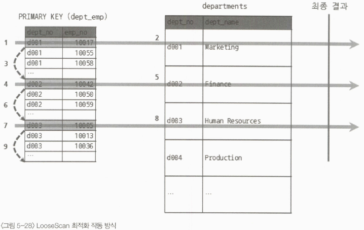

# 고급최적화 옵티마이저 스위치 옵션(1)

여러가지 최적화 옵션에 대해서 알아보자

---

## MRR과 배치 키 액세스(mrr & batched_key_access)

MySQL은 MRR(Multi-Range Read)이라는 읽기 방식을 지원하며,
이 방식은 조인 대상 테이블 중 하나로부터 레코드를 읽어서 조인 버퍼에 버퍼링하는 방식이다.
이를 통해 드라이빙 테이블의 레코드를 읽어서 드리븐 테이블과의 조인을 즉시 실행하지 않고
조인 대상을 버퍼링하여 스토리지 엔진으로 한 번에 요청함으로써 데이터 페이지 읽기를 최소화할 수 있다.

이러한 방식을 DS-MRR(Disk Sweep...)이라고도 부르며, 테이블을 조인할 때 최적화하기 위해 사용된다.

또한, BKA는 MRR을 응용하는 조인 방식인데, 쿼리의 특성에 따라 도움이 될 수도 있고, 안될 수도 있다. 기본적으로는 비활성화되어 있다.

---

## 블록 네스티드 루프 조인(block_nested_loop)

`참고로 MySQL 8.0.18 버전부터는 해시 조인 알고리즘이 도입됐으며,
MySQL 8.0.20 버전부터는 블록 네스티드 루프 조인이 더 이상 쓰이지 않는다.`

네스티드 루프 조인(Nested Loop Join)은 조인의 연결 조건이 되는 칼럼에 모두 인덱스가 있는 경우 사용되는 조인 방식이다.

```sql
SELECT *
FROM employees e
    INNER JOIN salaries s ON s.emp_no = e.emp_no
        AND s.from_date <= NOW()
        AND s.to_date >= NOW()
WHERE e.first_name = 'Amor';
```

이러한 형태의 조인은 다음과 같이 프로그래밍 언어에서 마치 중첩된 반복 명령을 사용하는 것처럼 작동한다고 해서 네스티드 루프 조인이라고 하는 것이다.

블록 네스티드 루프 조인과의 차이는 바로 조인 버퍼가 사용되는지 여부와 조인에서 드라이빙 테이블과 드리븐 테이블이 어떤 순서로 조인되느냐다.
조인 알고리즘에서 '블록' 이라는 단어가 사용되면 조인을 위한 별도의 버퍼가 사용됐다는 것을 의미하고, 쿼리의 실행 계획에서 Extra 칼럼에
"Using Join buffer"라는 문구가 표시된다.

보통 네스티드 루프 조인은 드리븐 테이블에서 연결되는 레코드를 찾기 위해 비효율적인 검색을 수행해야 한다. 이때 옵티마이저는 최대한
드리븐 테이블의 검색이 인덱스를 사용할 수 있게 실행 계획을 수립한다.

그런데 어떤 방식으로도 최적화할 수 없다면 옵티마이저는 드라이빙 테이블에서 읽은 레코드를 메모리에 캐시한 후 드리븐 테이블과 이 메모리 캐시를
조인하는 형태로 처리한다. 이때 쓰이는 캐시를 조인 버퍼라고 한다.

중요한 점은 조인 버퍼가 사용되는 조인에서는 결과의 정렬 순서가 흐트러질 수 있음을 기억해야 한다.

`더 자세한 내용은 책의 323pg를 참고`

---

## 인덱스 컨디션 푸시다운(index_condition_pushdown)

다음과 같은 인덱스를 설정하고

`ALTER TABLE employees ADD INDEX ix_lastname_firstname (last_name, first_name)`

인덱스 컨디션 푸시다운 옵션을 비활성화한 뒤에

`SET optimizer_switch='index_condition_pushdown=off'`

다음 쿼리의 실행 계획을 살펴보자

`SELECT * FROM employees WHERE last_name='Acton' AND first_name LIKE '%sal'`

실행 계획의 Extra 탭을 확인해보면 `Using where`가 표시된 것을 확인할 수 있다.
first_name 조건 때문에 인덱스의 범위를 좁힐 수가 없어 first_name 조건이 단순 필터링 조건으로 사용된 것이다.

이렇게 되면 last_name으로 인덱스의 범위를 좁히고 해당하는 모든 레코드를 읽은 후에 필터링 조건으로 결과를 도출해야한다.
만약 last_name 조건에 일치하는 데이터가 10만 건이나 되는데, 그중에서 단 1건만 first_name 조건에 부합한다면 어땠을까?

이는 매우 비효율적이고 99,999건의 레코드를 읽은 작업은 불필요한 작업이 되어 버린다.

한 가지 의문이 드는 것은 first_name 칼럼이 인덱스에 있는데, 왜 레코드를 굳이 읽어오느냐는 것이다.
만약 인덱스의 first_name 칼럼을 통해 필터링한다면 레코드를 읽는 작업을 훨씬 줄일 수 있다.

그러나 이는 first_name 조건을 누가 처리하느냐에 따라 달라진다.
위의 경우 first_name 조건을 MySQL 엔진이 처리해서 그런 것이고,
이를 스토리지 엔진이 처리하도록 하면 불필요한 레코드를 읽지 않도록 개선할 수 있다.

또한, 이를 활성화 시켜주는 옵션이 인덱스 컨디션 푸시다운이다.
고도의 기술력이 필요한 기능은 아니지만 쿼리의 성능을 향상시켜줄 매우 효율적인 기능이다.

---

## 인덱스 확장(use_index_extensions)

세컨더리 인덱스는 리프 노드에 프라이머리 키 값을 가지는데 옵티마이저가 이를 암묵적으로 활용해서
실행 계획을 수립하도록 설정하는 옵션이다.

즉 다음과 같은 테이블을 생성한다고 했을 때

```sql
CREATE TABLE dept_emp (
    emp_no INT NOT NULL,
    dept_no CHAR(4) NOT_NULL,
    from_date DATE NOT NULL,
    to_date DATE NOT NULL,
    PRIMARY KEY (emp_no, dept_no),
    KEY ix_fromdate (from_date)
) ENGINE=InnoDB;
```

세컨더리 인덱스인 ix_fromdate는 (from_date, dept_no, emp_no) 조합으로 인덱스를 생성한 것과
흡사하게 동작할 수 있다는 의미가 된다.

만약 인덱스 확장 옵션이 켜져있는데,
이러한 사실을 몰라서 세컨더리 인덱스를 생성할 때 기본키를 의도적으로 포함시키면 어떻게 될지 궁금하다.
(일단 바보 같은 짓은 맞다)

---

## 인덱스 머지(index_merge)

쿼리에 사용된 조건이 서로 다른 인덱스를 사용할 수 있고 그 조건을 만족하는 레코드 건수가 많을 것으로 예상 될 때
MySQL 서버는 인덱스 머지 실행 계획을 선택한다.

인덱스 머지 실행 계획은 3개의 세부 실행 계획으로 나뉜다.

- index_merge_intersection
- index_merge_sort_union
- index_merge_union


### `인덱스 머지 - 교집합(index_merge_intersection)`

각 인덱스의 조회 결과가 너무 많아서 각 인덱스의 조회 결과 중 교집합을 조회하는 방식이다.

### `인덱스 머지 - 합집합(index_merge_union)`

쿼리의 두 개 이상의 조건이 OR 연산자로 연결된 경우에 쓰이는 최적화 방식이다.
각 인덱스 조회 결과의 합집합을 가져오는 방식인데, 합집합은 중복 레코드가 있을 수 있기 때문에
이를 제거하는 작업이 필요하다.

MySQL 서버는 각 조회 결과가 이미 프라이머리 키로 정렬되어 있다는 점을 통해 중복을 제거한다.
예를 들어 각 조회 결과가 다음과 같다면,

```
(1): 1,2,3,4,5,6
(2): 2,3,4,5
```

두 조회 결과를 하나씩 꺼내어 키 값을 비교하면 중복을 쉽게 제거할 수 있다.

### `인덱스 머지 - 정렬 후 합집합(index_merge_sort_union)`

앞서 살펴본 합집합 방식은 각 인덱스를 이용한 조회 결과가 이미 정렬되어 있기 때문에 가능했다.
만약 정렬되어 있지 않은 상태라면 각각을 동일한 기준으로 정렬하고 중복을 제거한다.

---

## 세미 조인(semijoin)

세미 조인은 실제 조인이 아니고 단지 다른 테이블에서 조건에 일치하는 레코드가 있는지만 체크하는 형태의 쿼리를 의미한다.

세미 조인 ("= (subquery)", "IN (subquery)") 에는 다음과 같은 최적화 방식을 적용할 수 있다.
- 세미 조인 최적화
- IN-to-EXISTS 최적화
- MATERIALIZATION 최적화

안티 세미 조인 ("<> (subquery)", "NOT IN (subquery)") 에는 다음과 같은 최적화 방식을 적용할 수 있다.
- IN-to-EXISTS 최적화
- MATERIALIZATION 최적화

이 중에서 최근 도입된 세미 조인 최적화 전략들은 다음과 같다.
1. Table Pull-out : 항상 세미 조인보다 좋은 성능을 낸다
2. Duplicate Weed-out
3. First Match
4. Loose Scan
5. Materialization

2~4번 전략은 켜고 끌 수 있는 옵션을 제공한다.

### `Table Pull-out`

세미 조인의 서브쿼리에 사용된 테이블을 아우터 쿼리로 끄집어낸 후에 쿼리를 조인 쿼리로 재작성하는 형태의 최적화다.
보통 수동으로 쿼리를 튜닝하던 흔한 방법이었는데 이를 옵티마이저가 대신 최적화해주는 것이다.

다음 조건을 충족해야 최적화가 가능하다.
- 세미 조인 쿼리
- 서브쿼리 결과가 1건(UNIQUE 인덱스나 프라이머리 키 룩업으로 확인)

### `퍼스트 매치`

IN (subquery) 형태의 세미 조인을 EXISTS (subquery) 형태로 튜닝한 것과 비슷한 방식으로 실행하는 최적화 방식이다.
하지만 EXISTS (subquery)와 다르게 서브쿼리가 아니라 조인으로 풀어서 실행하면서 일치하는 첫 번째 레코드만 검색하는 방식이다.

퍼스트 매치는 다음 제한 사항과 특성을 가진다.
- 퍼스트 매치는 하나의 레코드만 검색되면 더이상의 검색을 멈추는 단축 실행 경로이기 때문에 해당 서브쿼리가 참조하는 모든 아우터 테이블이 먼저 조회된 이후에 실행된다.
- 실행 계획의 Extra 칼럼에는 퍼스트 매치 문구가 표시된다.
- 상관 서브쿼리에서도 사용될 수 있다.
- GROUP BY나 집합 함수가 사용된 서브쿼리에는 사용할 수 없다.

### `루스 스캔`

루스 인덱스 스캔과 비슷한 방식이다.
서브 쿼리에 사용된 테이블이 드라이빙 테이블로 실행되며, 드라이빙 테이블의 프라이머리 키를 유니크하게 읽으면서
중복 레코드 제거, 레코드 읽기에 대한 최적화가 가능해진다.



다음과 같은 특징이 있다.
- 루스 인덱스 스캔으로 서브쿼리 테이블을 읽고, 그다음으로 아우터 테이블을 드리븐으로 사용해서 조인을 수행한다.
- 즉 서브쿼리 부분이 루스 인덱스 스캔을 사용할 수 있는 조건이 갖춰져야 한다.

### `구체화`

구체화란 쉽게 표현해서 내부 임시 테이블을 생성한다는 것을 의미한다.
구체화 최적화는 세미 조인에 사용된 서브쿼리를 통째로 구체화해서 쿼리를 최적화하는 방식이다.

다른 서브쿼리 최적화와는 달리, 서브쿼리 내에 GROUP BY 절이 있어도 이 최적화 전략을 사용할 수 있다.

```sql
EXPLAIN
SELECT *
FROM employees e
WHERE e.emp_no IN 
(
    SELECT de.emp_no 
    FROM dept_emp de
    WHERE de.from_date='1995-01-01'
);
```

위 쿼리의 경우 employees 테이블에 대한 조건이 서브쿼리 이외에는 아무것도 없기 때문에
FirstMatch 같은 최적화는 별 도움이 되지 않는다.

따라서 구체화 최적화를 적용하여 서브쿼리 구체화를 수행하고,
임시 테이블을 생성하여 employees 테이블과 조인한 결과를 반환하면 최적화를 수행할 수 있다.

구체화 전략은 다음과 같은 특징이 있다.
- IN(subquery)에서 서브쿼리는 상관 서브쿼리가 아니어야 한다.
- 서브쿼리는 GROUP BY나 집합 함수들이 사용돼도 구체화를 사용할 수 있다.
- 구체화가 사용된 경우에는 내부 임시 테이블이 사용된다.
- 실행 계획에 임시 테이블이 생성됐음을 짐작할 수 있는 행이 추가된다.

### `중복 제거`

세미 조인 서브쿼리를 일반적인 INNER JOIN 쿼리로 바꿔서 실행하고 마지막에 중복된 레코드를 제거하는 방법으로
처리되는 최적화 알고리즘이다.

```sql
EXPLAIN
SELECT * FROM employees e
WHERE e.emp_no IN (SELECT s.emp_no FROM salaries s WHERE s.salary > 150000);
```

위 쿼리의 경우 salaries 테이블의 프라이머리 키가 (emp_no + from_date) 라면
salary가 150000 이상인 레코드를 조회했을 때 중복된 emp_no가 발생할 수 있다.

이때 쿼리를 다음과 같이 재작성하면 중복을 제거하고 동일한 결과를 얻을 수 있다.

```sql
SELECT e.*
FROM employees e, salares s
WHERE e.emp_no=s.emp_no AND s.salary > 150000
GROUP BY e.emp_no
```

사실 위 쿼리는 중복 제거 최적화 알고리즘이 적용된 결과와 동일하며, 이를 처리하는 과정은 다음과 같다.

1. salaries 테이블을 조회하여 employees 테이블과 조인을 수행
2. 조인된 결과를 임시 테이블에 저장
3. GROUP BY 기준에 따라서 중복 제거
4. 남은 레코드를 최종적으로 반환

중복 제거 최적화 알고리즘의 특징은 다음과 같다.
- 실행 계획의 Extra 칼럼에 별도 문구가 표시되지 않는다.
- 서브쿼리가 상관 서브쿼리라고 하더라도 사용할 수 있는 최적화다
- 서브쿼리가 GROUP BY나 집합 함수가 사용된 경우에는 사용될 수 없다.
- 중복 제거는 서브쿼리의 테이블을 조인으로 처리하기 때문에 최적화할 수 있는 방법이 다양하다.

