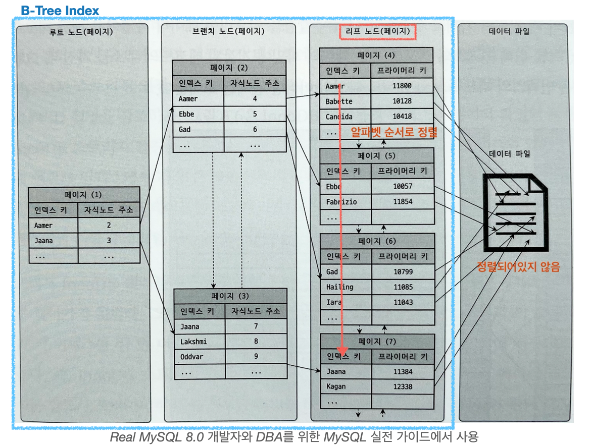
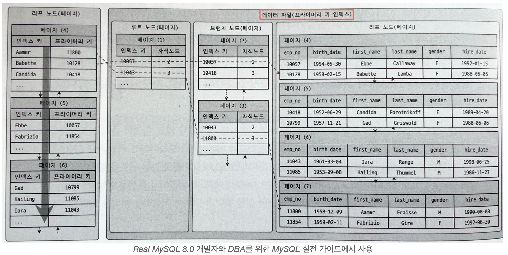
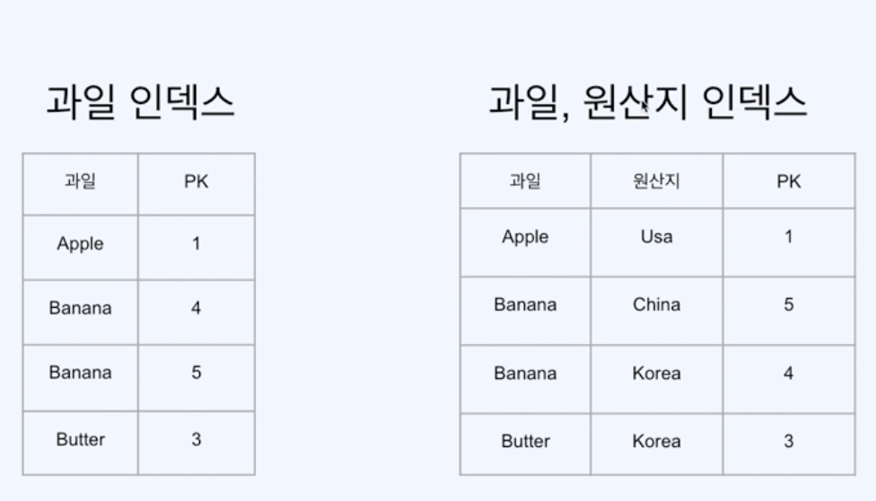

# 2/5

Created: February 5, 2023 11:18 AM

### 10장 인덱스

- 쿼리튜닝의 기본적으로 사용된다.
- 메모리의 물리적인 한계로 모든 데이터를 메모리에 저장할 수 없다. 그렇기에 디스크 I/O는 불가피하며, 이를 위해서는 디스크 I/O를 최소화하고 버퍼 캐시의 효율을 높이는게 가장 중요하다.

Random I/O 가 Sequential보다 느린 이유

1. System call 수의 차이가 발생한다. Sequential IO는 기본적으로 버퍼 캐시를 통해 시스템 콜 수를 최소화한다.
2. 파일시스템 시스템 콜을 호출한 것은 곧 디스크 헤드를 움직인 횟수이다. 디스크 헤드의 물리적인 움직임은 컴퓨팅에서 굉장히 비싼 연산이 된다. 

 ![Difference Between in Sequential & Random Speed of an SSD or HDD –  DESKDECODE.COM](data:image/png;base64,iVBORw0KGgoAAAANSUhEUgAAASIAAACuCAMAAAClZfCTAAABWVBMVEX///8AAACamprn5+e/v7/s7Ozv7+/09PT7+/udnZ2xsbHd3d16enq5ubni4uJ1dXXV1dWpqamSkpIwMDDLy8sgICCtra1tbW2Kioo9PT1gYGBJSUnR0dFUVFTGxsZEREQ1NTWCgoJQUFBnZ2cLCwspKSkZGRmMjIxdXV0WFhb//PTq3tfv+f/06N+IfniIiJn0///ZtqGaxdrdupx1mL/3686VjKCrsbfKupiuzPHGpIzW8//Fsq3A3O3/6MQnTW/V3udzeIbXwayXt8WclY5gbYHKxK/Eztvh4sxNc6a0jGQwWX2WmaO5pIONpLGCkK9HVGv2385XUzucfXiJscGxlYiZx+W2f2K+7vn82b5AWmdwRUmGin1rX3kAABm8l19Pi7LCp3GFaXBOdYG3qpKQq8t0YTZ0bWJQT11tiIUzZJ2OZiBLh7zVpnsAMWFLWHugi1R2WCUrc5wcMxBYAAAU1UlEQVR4nO1dabvjtnXm4U6C+yKKkkiJkijpumnaJk2cxXHixHactnbcJW6bulvq1um+/P8PBUBSIikCWubqzp07ep+Z55I6xAH5EjhYeHAgCHfc8aSIVoCxKOSbaJ+Be/wjwE3yuhW2AOsw3GCWlEfUGllRdfACKJJhbWJu1FnxqBT54FcHmoyOpW8WRXNoKpiiP6JaE0yO9M2i6OhuddtKXL8pUbqZJGMkSIjwh+oCoSOpOkBBkhR1jcJCzacXYzgiiA5CDi5FqFLl+G6SBGgoU202ThLX1JpzyXDxHdRZzAqcRa7tBVbzRlWisJZoJjmW1Vchgo2+CUIhMd7wUD24Nqdnckavap7Mg4T+HVMhuHqlSI3pqU1PKMK9LTLrX4I603aWZSUqa/7E+lLMr6Asq+MJEfjV8ZIyEW2qs5Tcc61h/djkVMhg2jYWKkAio9yt7hBLwxGSl+uyR5FF/owhFj3kl1BUj50uRog0j/gRrClM8Ysdk2upVFyKEYq2FYE9isAyPWTvYEFLRABQ5CgKCGNaCQvDQ6a7FCjL2xky55DhEy2ElY2QaZW4UM9hh4/t4kbVd0beROLP6kI6qc2sSFmIYE1+1zMYoAhBSRMpJaUTq6GlKYOR0LJFNUV1LYpgKQh9iuqsE2oVHYCqAOtYWwHLykDi5OoD0HepTyEnarN9YgnmelvRo0Ne00K6sUgGKqkb9EbKDb4ttybMG6KoaAy9DwYV5vTMpJyMKFHCnqIGS9AEhrlG9MoxbPe/aJuWFTBBrA4iUnU9WO0lUkPXzYDt84LaAoV0AXZyhZTUlxgqo6ktBigKwawuFemzAegt4RFFUjANyzJcE7V9iuTVAotKarVSONT7WVXmKiQgVtmZ5FcJYNxciJm0vMdkZBC6VwC5w8aqEqitR+mba0vYm2QCqyVEgxTJbbU9inaNiDQCm5Yoh/HhJDtkR0w0sd2biUlfi03al91IE24M/BAapmhl1BA1JkWo5mR/qSz0+etRpOMXEClU0RFFBsAIaUTrCYqCJj+qGhXUQtDK7oxp+8brij0K5pgiu2qrGjS2QEs7FEX0qg10zCOXIrNqtgU9PaaohKqW5JSisFPRdofLJrUZb0GTcftZ95/0PKlb4RsixRRJ3Sqwql8Masx1RcqYstDY8hp9ivzmlFDkHxQdUdScWJSiorHKAm3EDpXH6L69GgkcRt9F81oeGfvCacMCV+xppwGSIaaVfVVRtKyeW1rTu53t3yBFlyK77l3uS1HVAO0GKNpUpWhW2SLULgtuXfhornBcjAivB4qCG9U03FEzkarkRVWV8Y3sZEVFo4R2ilNIc9VbQUwpwmbRVyR/HVYvFPcvRaRJuRhLQp8iome7NRqKFJyNo+ZLrOiIItwDtVU8YgkrVguqFY3muMKpa5jaihptSauObdZ4pimRMce9i1ko5pKGtuTdOXEg42Ox+8oeD5t9O2FUTxjXp7Q01WMKc1UZpQk9y6J6gsNqknabOyo0ugMQo7pQHjDXejXkmc7qktZoJYWpHg5VHR+jyW5Ge2oVbPo6KtymnuExpLhaTperZtiIB66T6TQbR5UV0MTldBXhClLZ7VE2zXxBy2uT6o1x0mREa0ae1wproRJF0exwGq2mUwsJXk5qbt6pMjrOI/N1fa+1wOdb73A3E7OygU6Q4RODXoZ8rDAT6V07owQfB7c21nzsHnUy6UXiTtFJ3Ck6iemdolNQ7wzdcccdd9xxxx0vCZJsiD5jrKcjf1wYA5/f30ChJJt2dMUHI00uXMO2t4vpwMcCNShDazQq4vkbL9T8VeLnkWzYl5IUbc26gywfzc3pxtqq34j9pgv9NKhndRzzogk2bWQeOFWqj8Z7oHDnvBRhmhx40eULRk2S2am2TmcC0+++ijdb2GFMi852B3Lk3kc4f3o4Hj84L0fYq1oSw6AfwTk2auVMqKdRV+kR0+HLEaLzipFy3MzLVppWzgWTY4eBFyRUJUk7gyRtwGYhqP18JrsXLdQ855yWf9AXwKcfWoRi/sKF6lkUDSMjX87FxYsXStdR5ImiUcDYCPB/sQ/j5QiJb4B+HUXUrcDWFFpAX7rwOkfpyvNCD/23QngVqqTF5O0QngeF+Jcg8hk9Qk1SPx52e3thQp0MLDRZr0lgYkKcLBag1v6wJKlc+4gP6n1pwoD4IE24LmweuTin3tB5nVQLGDMFL01IXEck4rbpXVLvuNe+LUI+nt3t3il6lkI+8uN+6AHjlyMsTlNxxx133HHHy4FuB8ylXFgWDKwpqOGJAW/YYzOGBRhGEIzZ68ccdqbeOAgCZluuGVvjFuutzOlucCaBwF76fu3TP4DU8NdjllBQYvZCVTDNEXPAJIPY/vDTgTMy7YQlVCExE7jJ2k+DSRGBxFuSq7KFc8ShiKNSP/WQ85whsMkKksRmSF8JfIoc3vN4MUtiTzhEgOUyq2i+s5MxhyX2/eRkkeiUReArgU9RypauJsCyKKQssCmyZJO5osWGMB/H7OnUgj2sKMpVeZseNZei3UBMlAazaDxnmMfC51cngVkNZTKtk7HbAXY9VBfiTFw8uS3aJfy0LqPqw3SZAa/Q6yyKIiIomBbFZC83t13ODb0afOYqLn0ytNSyhkLmqmJG8+wgJIHEKGKKgkkY+HZaATehKjDdFUp2JyQPVUENb2CL7BjWMaNcY7uwCBeMhFFchhvefAOzokWbcDNlVogIyjWzo+Hxaq8F4eDy2VeFpqgqKyqPjkUK041JUxRuR43t/4Tz5N8RW8bNUeXqveOOO+6444477rjjjjueG1RE4VwyB+xkzDHVS8SojuGyEM93EkRDgXZfLkxYWq6bLKAVE/AU3jqK6EIdPV/D2TMvbx1F9Ryk0QQMm8ly3p7XiNqnWCi1KIpkuTWbrecyDVZErjqapeipdfC1++9GWM1+mRTCgkN83lyWZ7VEwcfRzcMUDsA8RImrYoGt93EbaRFDNCpWPZOmpDR4llNTZD6Q0zmdMbTB9EjSEglSCs06jT06ajEPVbDfap7NoLI1zcOhUXjrKTaNRneHNQ2C6B4iQT4x9hSNmti6k20wqW/FhAI/VjCtH1gj0cS2JVgVRT428lsSaxHRSy1Yj7cbCKUY3CDtxRPsqKVhbt3Aiuk1mIf5NtgBWdOBADYFPq4cPjNsIIPtjgYZS7CGgGh4Ak56aL7eSGUV6a56+UpZP3dlxEWgX0Td6s+YhhUlAeUouwn91a4eX08hpqvEVt1Isx21eh23TfBUSnQd5VEgXr5UpUdp9yCuqqtMPoDWS/dus18AFyYkvmEEGXQj21aOu2b90jQan0+HOujinFIU1EVCX5BntOtLR3WUPATlQG6VWqMd4DJurVXIm5rok9C8sxbLzuuoYTX2MWb38+QyWX9S0HOzucmMPHfexMgV6/C59bMF5Lnt+lLUXNQP191SO23Fa/SaSMkEViOQCIkI1vu2QILzG9zHBrYhsm2LaRNmck+ZK7QM1YRQZDcu4VUIw3UdqBhTVxBhden+dXetRkftAxy6qXm7QrYC7y5prpAGdlVyLYBwa7+OBm1viwoIaXBBfHOBKcv+IEX1uKMK5LjngLaFfIq6atuivO2Kv4RFjZDYQH1Lm1OXWiSRxpKfvIbgXHsW5rQPOa9pmA1SVLvOyFS4acLByqdLUVftphVINm93Q7P+mgTdM1ebOji74JlJDOvH3HXiPOxZyGnE2ebBggGKZrCozsZUmDXBXgvy/HyKumonrU6T07ZZxZBzk7o4mC5tCjf5QM3FnoUqhH7daKnlAEVC3TzXQr/qAgjShrz7UxS11dqwOIjmrfDHMxhaI7RtWWrj9iGuj3CgKCJBijNIcM1HyyFzjVuyEnMk7SqhvgYLWwY0paTwKeqqxd2fDOmCLhkSyRYMlayNFmk+qYfLsuYYOCMkkrjh+myNO0nSFhGLhOLB5Yy3xYEiYYfHGbjTtsnw6KBnrndVZwd3s+f4MY3qQXEfeb3EPy2U1qVOM2PQoairljj9QUrOienBfcfNchnS3rWGtS8yfELqFtZfTrOU9jMdejx/LQOQKNmXYuTilikio6fMUxK/LTSSqp9bkDFZVAlxAjKGisdaW4+S1OYk6TgkdNRiKrakfUqDatBLwyFPqvQGHb1lZLWUJtJOwJRULd2g8fo5/mFPCVXl+BJoqqp3T8/tqvTU6mpLU1sNEWgtgdo+fvrm7I477rjjjjvuuKOBpiqebBrBdhsEhplLZ/eDKui4N6N4uW36RkB1BKI/siOE+z4voI+jKZHoLsO4TLOVNQ62QeFOpuGmXFojloP1HroqeaPASpaLMo7DdLlbudYYM7QNxlYyyaaLeFMuMnc8Qnwn3GcMFRmTRbkszFk/qpTmzIxVGbo5yw3dwcRmizKcJmM/95DE6BFrEprZ29U8DnfjXHrTSpQz2pWpKyP2+9WRP43dnse95kTBKsWFwxp56OzJQQ1FQRaniXybrXNuARQsysQ+436dIM6aiQndycfLMtwVNrpqL1oN+ZNyarzezWHOg2SEseWdax10s1xJgjYzsrKcbKNX3KhXjaxyPnrm3vj5DpLZRc+pLGEeTgubsuPZ1jLE1rlcTIzrvr1reQLWufE9nx76KF74Fz3YzEghC7KUJFLtHYSuKDsqbuSRvd0BZ4UZD2qwXj5PknQRMvaqpmOo9gTCMYk1JQSlE+1g0qsiup3BldNfPkyeoekWYXKBqURi2aZkB+loqHpKA3stnns77PXsJACYad5+R9QuTNidT5C3BShaj27ARHxgGFlvfeVMs5qxFuHi4g67wt1cW0SvAlqXZ78TVAAEbVNhQobZHT2wjLy1vvLrqQyDiwODxpxL08VTdTd16+xvd04AIHaKGwrDit0xc1WnyVyTfQJKODniwIPdobxuy6fhKKr3fT8JzU+hH9OiOHz2C5k8R9dyJLiLXgMrdp1D3PP9V18BxZkeKVECq/6Vs/Xq8AgImP2FiL00+ASCuG3j9NW8V2kfbu9Oo8wn53SEVCNc+EcGeQydjk9RMGMEy6AK15WkoNT2KbXlUaHJQzzyuUrxuZitzwnP5iXr5PgBpfmuQ4jmgQ+sKutPueukORhnTQQEbX4U1kFDcRDe9PO1fU4ly6elMdAm5f32Rp8C01FTn8XAroc86Pa6dgscYIhu9Hud3jPhb06aCG0UpvJQ0RDXR31CZc2mCHdlrvTCI75ttD5nQ6FByA69V6k9D/7iVIdF88vVsAlxlwNWJx90/6yAi9GVPT0U0pTucBfU6/tTXg9J7iH3wcib476Q/hgZawjyfEAYZWDnxynzRdw9bx8bkDGFx3l3bzTL8y3YgynzdNPVdD1FoiJ1oJiAmp+Uoickv0ljSJCqDAiVCMbaYErVap92hYrGEfZz6Ao1VxuBwxD283wFinrnars7N9CsyXGGGEKnVWWeKAzqqbs9U8hHP2k84ggFlIYRS4jaw5UnomhhcITnq+Wjm1S3dmyhFhVtb8KesNtR6Kfk5Kl1Z+suSKkXU7aQm/IidJPOu9M4XWHaXbnXTzliC5c8tX63Sbsg5bzbX7gg5UXo3e6c80b9uc4TslNGsOQVFE4pkrkpr8/zIjyB0ZD7g9WzUxp9d/Qb5cnH7Snyj4bzZ6bUk6M+7I3y5IObtOsv3/vEfqZwHB71t7nL1PdCtHBP5MlUe2mefJicSOOG297bx7DSi4VGsIyPNgjqphwWGkGyzgx+ngy1w3k+yRyb4PAWTw8LpfmV663RNJNO5jmMq/N8BDgA7Ei7g0L5yiGqYq3NM/IcxLV5PgoUAPZHrAGhXsRXzWppIhSNLeHmOYBr83wkaDB9YLkOYeEEjE6/CYWraya1dANWh6aem+cxrszz0aBthTlzORMW2p3VUMFVS5/UACbt9pqb5xGuy/Nx4XC3OzIOHHlxdsWHROSCe5QBP88Wrsvz0WEyP64SGHWPTXOvWGCo2ykEQ19K+Hk2uCrPm2Cc8qRVc4LN7cVfQ6MElqyZwS03zwrX5HkrWNwP5up0aVzu4BJZsDY4Tmj8PAUy4Ng9J6eaLe8TKm6PYHnZvuzmCh7EE0kCXp64k5A9M9cs5k52gpdA4uBXmppnegPI4xiW5hlG9lSezw0q7gIddz/QdvNQ/5xnsDO4DtO6FhluDHPj3I7eyTyfG9AKVuZ+PYOuIT952GxbU+2a7K43u62JtO5iBV3THNkoshgWln3Z1/yTeT43KOZuUy4T13KTLHwIE/vYGjh5sAs38WI5wZdZluuusnkYb8KlZUZnbtx+cZ7PDc4ssk07nyFOY6RLaBbhy0x8YTTzrnNPvzDPO+6444473nqgjDPhUjwA0//RBoDNgqWVBJVhNmR2CSV7iB6seRueTJibaQkLfEe3mDzy7IA98etLmsXasU3QdSFgPYtnq9pqeAt34ioV6WznYmsnqcwtgAQ54ewppus3GvnzN//iblDFdxBmpTTJ7P2Y8b65W9YRndftTPdq4FMUsMqCQN14OZBZUmeNBLRmjEPlScZxhSwMHkU3C2fEowiA522/5M35KewiJh7C1B5BxoYIAWOixNnwykou6Kc2K7sS/FLksZ9U4ZVsCZiuhh4uQc6aQb1M/LUtBvdkn0ZuddJuU9lO2KKC2UgEnC+CHIYEs+CoRWQbPdamlOn6OOhxL1u27GpoaiCyoknNTEny2R8jWNVBILdqaMxtwxDYqs0snNNMsnm7fjJJmJmKF17yjfJc2HGasraQcyaLcMWsZxHPkKdpyNx8TsinIXuTQi0JucthmU2EswvTt2qfhDvueF4g9fZ3vtGc/e43OJe+cLzzzd/7/d5Pf/Ctb//hd7777ve+L/zgh/VFwXs/evI7ezZ4/8c/eefrD376sw/f++hj6+cfup/8Qnj/F3/0x9/72Z98+tkvP80/WklffvBJ8vnH33rP/eHrvtfXhT/9s+9+8YM//4tv/uqLv/yrv/71h7i0vPM3X375t84HX/3dj/7+3X/4x9/8k/Gbnxdf/fOH//L9132rrwnf+eXX0ST5+Ne//dUX3/5X+bfvfvJvgvDv//Gf//XOR59+9t//8+6Pv559Lv909flXnyX/+7ZSRKZnyD96iDtYXeH7/ye0pXecxv8DZ2RteOyx3PAAAAAASUVORK5CYII=)

SSD에서도 Throughtput은 Sequential I/O가 Random I/O보다 더 크다. 또, 랜덤 I/O를 순차 I/O로 변경할 방법은 많지 않다. 그렇기에, 쿼리를 튜닝하려면 랜덤 I/O를 줄이는게 중요한 목표라고 볼 수 있다. 

**인덱스란?**

 인덱스는 기본적으로 정렬된 상태를 유지한다. 그 예로, SortedList와 비슷하다고 볼 수 있다. 그렇기에 찾고 싶은 내용(읽기 성능)에 대해서는 빠르게 처리할 수 있게된다. 하지만, 항상 정렬을 유지해야 하기 때문에 인덱스 테이블이 많아질수록 Insert가 느려지게 된다.

 인덱스를 역할별로 구분하면 Primary key와 Secondary key로 나뉜다. Primary key는 Clustered Index로 생성하게 되고, 대표하는 값이 된다. Secondery key는 보조키로, 대체해서 키를 사용할 수 있다. 유니크 인덱스도 이에 대한 일부 중 하나이다. 

 인덱스에 종류에는 B-Tree 알고리즘과 Hash 인덱스 알고리즘이 존재한다. B-Tree는 인덱스는 컬럼 값을 변경하지 않고 원래의 값을 이용한 알고리즘이다. Hash 인덱스는 알고리즘 컬럼 값으로 해시값을 계산해 인덱싱하는 알고리즘이며, 빠른 검색을 진행한다. 하지만 해싱의 특성상 값의 일부나 범위 검색에서는 해시 인덱스를 사용하기 어렵다. 그렇기에 주로 메모리 기반 데이터베이스(Redis)에서 사용한다.

**B-Tree 인덱스**

 가장 일반적으로 사용되며 가장 먼저 도입된 인덱스 알고리즘이다. 인덱스는 정렬된 상태를 유지하며, 전문(fulltext) 검색과 같은 특수한 요건이 아닌 경우 거의 B-Tree를 사용할 정도로 일반적인 용도에 적합하다. 인덱스의 키 값은 모둘 정렬되어 있으며, 데이터 파일의 레코드는 정렬되어 있지 않고, 임의의 순서로 저장되어 있다.

 기본적으로 인덱스에서 리프노드는 인덱스 키에 대한 값으로 PK 값을 갖는다. 이 PK값을 통해 실제 데이터 파일을 O(log(n))의 시간으로 접근할 수 있게된다. 리프 노드가 아닌 노드들에는 인덱스 키에 대한 값으로 자식 노드의 주소를 갖게 된다. 그리고 이 인덱스는 항상 정렬상태를 유지하며, 이는 삽입, 수정, 삭제에 대한 성능 저하가 발생하는 원인이 된다. 

 MySQL8.0부터 InnoDB를 사용하는데, InnooDB같은 경우에는 데이터 파일에서 PK를 클러스터 인덱스로 구성한다. 다시말해, 논클러스터 인덱스 → 클러스터 인덱스 → 데이터 파일을 거치게 된다. 추가로, 조회할 때 논클러스터 인덱스나 클러스터 인덱스 값으로만 사용하게 되면 실행 계획이 using index가 나타나며, 커버링 인덱스를 사용하게 된다. 

 innoDB는 체인지 퍼버를 통해 insert, update를 진행한다. 여기서 성능 저하가 발생하지만, 그만큼 조회의 이점을 위해 사용하는 것이다. 인덱스 설계는 굉장히 중요한게, 다음 경우에 인덱스를 타지 않는다.

1. 인덱스를 구성하는 키 값의 뒷부분만 활용하는 경우
2. 인덱스 키 값에 변형이 가해진 후 비교되는 경우 등

 그렇기에 인덱스를 잘 활용하는게 중요하다. 또, InnoDB. 테이블을 지원하는 잠금이나, 넥스트 키락이 검색을 수행한 인덱스를 잠근 후 테이블의 레코드를 잠근다.

**인덱스 영향 요소**

1. 인덱스 키 값의 크기
2. B-Tree의 깊이 → 키 값의 크기가 커지면 하나의 페이지에 들어가는 레코드가 줄어들며, 이는 곧 b-tree의 dept를 증가시킨다.
3. cardinality
4. 읽어야 하는 레코드 건수
    1. 인덱스의 손익 분기를 따져야 한다. 너무 많아도, 너무 적어도  손익이 안난다. 읽어야 하는데 레코드가 전체의 20~25% 정도가 좋은듯. 그걸 넘어감녀 오히려 손해.

**인덱스를 통해 데이터 읽기**

1. 인덱스 레인지 스캔

 인덱스 테이블은 정렬되어 있으므로 특정 범위에 대해 레인지 스캔을 통해 랜덤 I/O를 줄일 수 있다. 하지만 상기한 바와 같이 읽어야 할 레코드가 많아지면, full scan을 진행하는게 좋을 수 있다.

2. 인덱스 풀 스캔

 커버링 인덱스라고도 하며, 조회 시 인덱스에 있는 값들로만 결과를 내줄 수 잇을 때 주로 사용한다.

3. 루스 인덱스 스캔

 Mysql 8.0부터 등장했으며, 듬성듬성 인덱스를 읽는 것을 의미한다. 일반적으로 group by 또는 집합 함수 가운데 MAX()혹은 MIN() 함수를 최적화 하는 경우에 사용한다. 옵티마이저가 전체 레코드를 다 읽을 필요가 없다는걸 알면, 조건에 만족하지 않는 레코드는 무시하고 다음 레코드로 넘어간다. 이는 실행 계획을 통해 살펴볼 수 있다.

4. 인덱스 스킵 스캔

  

5. 복합 인덱스(다중 칼럼 인덱스)

 실제 서비스용 데이터베이스에서는 2개 이상의 칼럼을 포함하는 인덱스가 더 많이 사용된다. 복합 인덱스는 column의 순서가 굉장히 중요하다. 다시 말해, 검색 범위를 최소화할 수 있는 순서로 복합 인덱스를 구성해야만 한다.

인덱스 정렬 

 기본적으로 InnoDB는 단일 링크드 리스트로 구성되기에, 오름차순 인덱스에 내림차순 조회를 진행할 때와 오름차순 조회를 진행할 때 성능 차이가 난다. 방향이 다른 조회의 성능이 떨어지기에, 만약 내림차순 조회가 많다면, 내림차순 인덱스를 생성하는 것도 고려해볼만 하다.

**인덱스의 가용성**

 인덱스의 특징은 왼쪽 값에 기준해서 오른쪽 값이 정렬돼 있다. 그렇기에, 복합 인덱스의 컬럼 순서가 영향을 주는 것이다. 또한, 다음과 같은 경우에 인덱스를 타지 않는다. 

- 적절하지 않은 복합 인덱스 순서 ((a, b) 복합인덱스에서 b 조건) -> (b, a) 
- Not Equal로 비교된 경우
- Like %??, %??% (뒷부분 일치로 검색), ??%(이것만 탄다)
  - FULLTEXT INDEX(전문 검색)

- 스토어드 함수나 다른 연산자로 인덱스 컬럼이 변경된 경우
- 데이터 타입이 서로 다른 비교([캐스팅도 포함](https://tech.mfort.co.kr/blog/2022-06-15-search-function-troubleshooting-query-dsl-cast/))

**R-Tree index**

 2차원 데이터를 인덱싱하고 검색하는 목적의 인덱스로, GPS나 GIS 등에 사용된다. [우버의 사용 사례](https://medium.com/@buckhx/unwinding-uber-s-most-efficient-service-406413c5871d)

**인덱스 관련 좋은 글들** 

- [jojoldu 인덱스 정리 및 팁](https://jojoldu.tistory.com/243)
- [커버링 인덱스](https://tecoble.techcourse.co.kr/post/2021-10-12-covering-index/)
- [클러스터, 논클러스터 인덱스](https://hudi.blog/db-clustered-and-non-clustered-index/)
- [Mysql 내부 구조](https://brunch.co.kr/@jehovah/21)
- [인덱스 내부 구조](https://tech.kakao.com/2018/06/19/mysql-ascending-index-vs-descending-index/)

---

정리해놓은 인덱스 

### SQL 처리 과정

- 쿼리 실행 계획 → 통계 데이터로 진행, 딕셔너리에 저장해둬서 비용 산정.

인덱스 처리는 대용량 데이터를 소량으로 검색할 떄 사용

인덱스

- 칼럼 가공하지 않기. 가공하면 인덱스를 안탐, 혹은 타입이 다르면 인덱스를 못탄다.
- 복합 인덱스 고민해보기
    - 다음 예는 과일, 과일 + 원산지 인덱스를 탄다. 원산지만 where을 걸면 인덱스를 안 타게 된다. 과일 원산지가 들어오게 되면 인덱스를 타게 된다.
    

- 하나의 쿼리는 하나의 인덱스
    - where, order by, group by 혼합해서 사용할 때 인덱스를 고려해야 한다.
    - 의도대로 인덱스 동작 X, explain 확인하기. 개발 환경과 배포 환경이 다를 수 있다.
    - 결국 인덱스도 비용이고, 꼭 인덱스로만 해결할 수 있는 문제인가?
        - 인덱스는 코드만 변경하면 되서 제일 풀기 간단하다. 다만, 이로만 해결할 수 있는게 아닐 수 있다.

복합인덱스 사용 시, 범위 검색을 뒤로 두기

인덱스 테이블 수정도 가능 

- 조인 모수 테이블 줄이기로 노력해볼듯
  
    

**클러스터 인덱스**

- MySQL 기준 PK로 클러스터 인덱스가 생성됨
- PK + PK의 주소로 구성. 리프노드는 모든 PK 값의 주소가 존재한다.

**논 클러스터 인덱스(세컨더리 인덱스)**

- PK가 아닌 값들로 만든 인덱스로, 인덱스로 만든 컬럼의 데이터와 PK로 구성. Unique 인덱스 같은 것들?
- 논 클러스터 → 클러스터 → 조회가 진행된다.
    - 오히려 퍼포먼스가 나빠질 수도 있음!!
        - ex) Where 잘 걸리고 order by, group by로 잘못 걸리면?
- 복합 인덱스는 이에 해당된다. 복합인덱스는 여러 컬럼을 인덱스로 만드는 것. 순서가 중요하다.
- 결국 인덱스는 별도의 테이블을 만드는 것임.
  
    [[mysql] 인덱스 정리 및 팁](https://jojoldu.tistory.com/243)

궁금증

- 키 락, 갭 락.