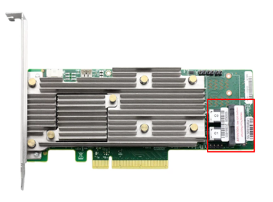
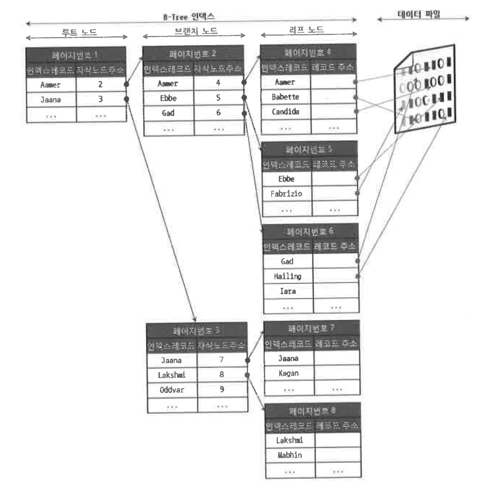
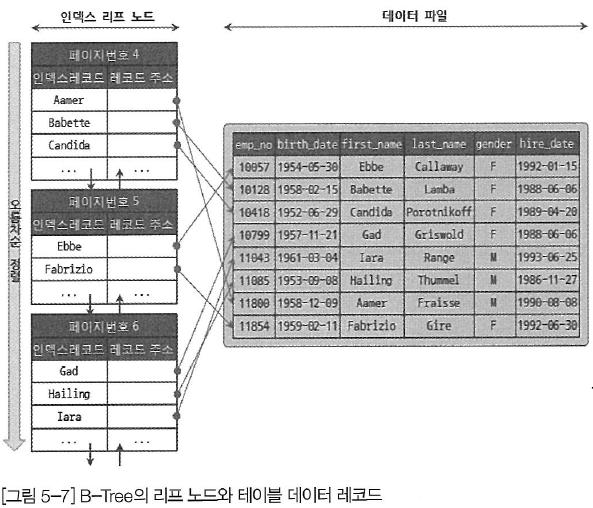
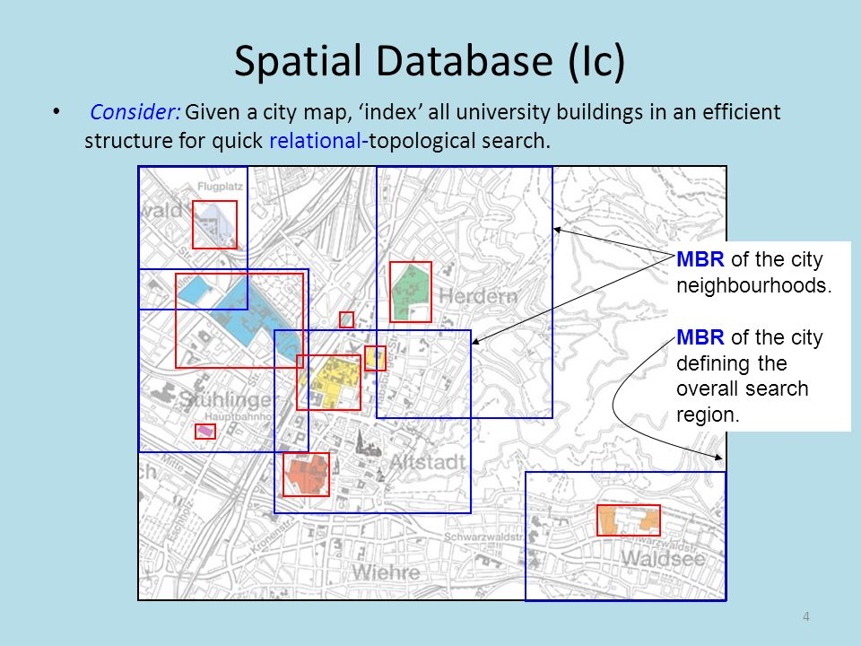
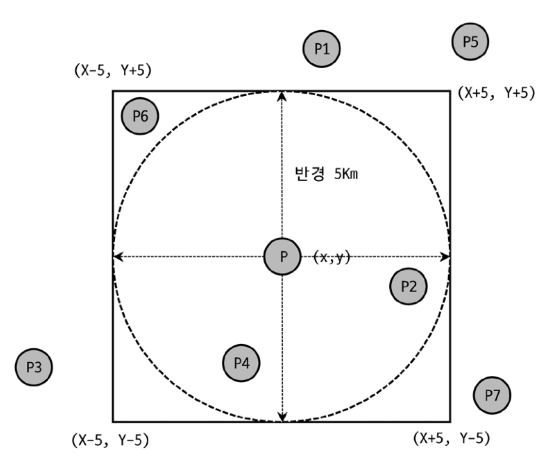

디스크 읽기 방식
===

비록 하드웨어가 SSD로 많이 대체되었지만 컴퓨터에서 여전히 디스크 I/O는 가장 느린 성능을 가지고 있다.
그래서 DB의 성능 튜닝은 어떻게 디스크 I/O를 줄이느냐가 관건일 때가 많다.

---

## HDD와 SSD

기존의 HDD는 기계식 장치여서 이를 전자식 장치인 SSD로 대체하려는 움직임이 많았다.
SSD는 HDD에서 데이터 저장용 플래터를 제거하고 그 대신 플래시 메모리를 장착한 것으로,
디스크 원판을 회전시키지 않아도 되기 때문에 HDD보다 훨씬 빠르다.

---

## 랜덤 I/O와 순차 I/O


위 그림을 보면 순차 I/O의 경우 한번의 system call이 발생했지만, 랜덤 I/O의 경우 세 번의 system call이 발생했다.

즉 기록해야 하는 위치를 찾기 위해 디스크 헤더를 세 번 움직여야 한다는 의미이다. 이는 HDD를 예시로 든 것이지만, SSD의 경우에도
여전히 순차 I/O보다 전체 Throughput이 떨어진다.

참고로 랜덤, 순차 방식 모두 파일에 쓰기를 실행하면 동기화 작업이 필요하다.
그런데 파일 동기화 작업이 빈번하다면 순차 I/O라도 랜덤 I/O와 같이 비효율적인 형태로 처리될 수 있다.
이때 `RAID 컨트롤러`의 캐시 메모리는 아주 빈번한 파일 동기화 작업이 호출되는 순차 I/O를 효율적으로 처리될 수 있게 변환해준다.

그런데 사실 쿼리를 튜닝해서 랜덤 I/O를 순차 I/O로 바꿔서 실행할 방법은 그다지 많지 않다. 일반적으로 쿼리를 튜닝한다는 것은 랜덤 I/O 자체를
줄여주는 것이 목적이라고 볼 수 있다. 여기서 랜덤 I/O를 줄인다는 것은 쿼리를 처리하는 데 꼭 필요한 데이터만 읽도록 쿼리를 개선하는 것을 말한다.

---

### RAID 컨트롤러

RAID(Redundant Array of Independent Disk)란 여러 디스크에 늘어나는 데이터를 담고, 보호하기 위한 기술이다.

하드웨어적 RAID 기술에 대해서 알아보자.



위 사진 처럼 생긴 PCI 카드를 서버에 꽂고 오른쪽에 SAS 케이블로 디스크 혹은 디스크를 여러 개 꽂게 해주는 Backplane을 연결하면
데이터가 알아서 양쪽으로 쌓이는 방식이다.

핫 스왑 기능도 있어서 고장 난 디스크를 뽑고 새로운 디스크를 꽂아주면 알아서 데이터 복구가 일어난다. 단점은 `비싸다`는 것이다.

```markdown
RAID 컨트롤러의 캐시가 어떤 식으로 순차 I/O를 효율적으로 처리하는지 찾아 보았으나 관련 내용을 아직 찾지 못함
```

---

인덱스
===

DB는 모든 데이터를 검색해서 원하는 데이터를 가져오려면 시간이 오래 걸리므로
칼럼의 값과 해당 레코드가 저장된 주소를 키와 값의 쌍으로 삼아 인덱스를 만든다.
중요한 것은 인덱스의 키값이 정렬된 상태여야 원하는 키값을 빠르게 찾아갈 수 있을 것이다.

이러한 특징을 자료구조에 빗대어 생각해보면 SortedList를 예시로 들 수 있을 것이다. SortedList는 항상 값을
정렬해야 하므로 저장하는 과정이 느리지만, 이미 정렬되어 있어 빠르게 값을 찾을 수 있다.
이와 유사한 DBMS의 인덱스도 인덱스가 많은 테이블에서는 INSERT, UPDATE, DELETE가 느려질 것이다.
하지만 SELECT는 매우 빠르게 처리할 수 있다.

결론적으로 DBMS에서 인덱스는 데이터의 저장(INSERT, UPDATE, DELETE) 성능을 희생하고 읽기 속도를 높이는 기능이다.
즉, 인덱스를 추가해서 데이터의 저장 속도를 어디까지 희생할 수 있는지 결정하는 과정이 필요한 것이다.

---

## 인덱스 분류

인덱스는 알고리즘과 중복 값의 허용 여부 등에 따라 여러 가지로 나뉠 수 있다.

`기준: 역할`
- 프라이머리 키 : 식별자
- 세컨더리 인덱스 : 프라이머리 키를 제외한 모든 인덱스. (유니크 인덱스 포함)

`기준: 알고리즘`
- B-Tree (위치 기반 검색을 지원하기 위한 R-Tree 인덱스가 있으나 결국 B-Tree의 응용 알고리즘이다)
- Hash
- Fractal-Tree
- Merge-Tree

`기준: 중복 허용 여부`
- Unique Index
- Non-Unique Index

중복 허용 여부는 실제 쿼리를 실행해야 하는 옵티마이저에게 상당히 중요한 문제이다. 단 한 건의 레코드만 찾아도 된다는 의미이기 때문이다.
그뿐만 아니라 MySQl의 처리 방식의 변화나 차이점이 상당히 많다.

`기준: 기능`
- 전문 검색용 인덱스
- 공간 검색용 인덱스
- ...
  수없이 많은 인덱스가 있지만 MySQL에서 이 두 가지만으로도 충분하다.

---

B-Tree 인덱스
===

B-Tree (Balanced Tree)는 칼럼의 원래 값을 변형시키지 않고 인덱스를 항상 정렬된 상태로 유지한다.
특수한 알고리즘이 아닌 경우 대부분 B-Tree를 사용한다.

---

## 구조 및 특성

B-Tree는 `루트 노트`, `브랜치 노드`, `리프 노드`로 구성되어 있다.



대부분 RDBMS의 데이터 파일에서 레코드는 정렬되지 않고 임의의 순서로 저장된다. 하지만 InnoDB 테이블에서
레코드는 클러스터되어 디스크에 저장되므로 기본적으로 프라이머리 키 순서로 정렬되어 저장된다.

```
InnoDB에서는 디폴트로 클러스터링 테이블이 생성된다. 비슷한 값을 최대한 모아서 저장하는 방식이다.
```

아래는 MyISAM의 리프 토드와 데이터 레코드의 관계를 보여준다.



MyISAM은 리프 노드가 레코드 주소를 가지는데, 이는 테이블에 INSERT된 순번이거나 Offset이다. 즉 프라이머리 키와
세컨더리 인덱스가 해당 값에 대한 포인터를 가진다. 반면에 InnoDB는 프라이머리 키가 ROWID 역할을 한다.

두 엔진의 인덱스에서 가장 큰 차이점은 `세컨더리 인덱스`를 통해 데이터 파일의 레코드를 찾아가는 방법에 있다.
MyISAM 테이블은 데이터 파일을 바로 찾아갈 수 있는 반면에 InnoDB 테이블은 프라이머리 키 값을 이용해서
프라이머리 키 인덱스를 한 번 더 검색한 후, 프라이머리 키 인덱스의 리프 페이지에 저장돼 있는 레코드를 읽는다.

---

## 인덱스 키 추가

새로운 키 값이 B-Tree에 저장될 때는 B-Tree 상의 적절한 위치를 검색해야 한다.
리프노드가 꽉 찬 경우 리프 노드가 분리돼야 하는데, 이는 상위 브랜치 노드까지 처리 범위가 넓어진다.
따라서 B-Tree의 쓰기 작업은 상대적으로 비용이 많이 드는 작업으로 알려져 있다.

비용을 대략적으로 계산하는 방법은 테이블에 레코드를 추가하는 작업 비용을 1이라고 가정하면 해당 테이블에
인덱스를 추가하는 비용을 1.5 정도로 예측하는 것이다.

```
인덱스가 3개가 있다면 5.5 정도의 비용(1.5 * 3 + 1) 정도로 예측한다.
```

InnoDB는 필요하다면 인덱스 키 추가 작업을 지연시켜 나중에 처리(체인지 버퍼)할 수 있다. 하지만 프라이머리 키나 유니크 인덱스의
경우 중복 체크가 필요해서 즉시 B-Tree에 추가하거나 삭제한다.

---

## 인덱스 키 삭제

키 값의 삭제는 삭제 마크만 하면 작업이 완료된다. 삭제 마킹된 인덱스 키 공간은 계속 그대로 방치하거나
재활용할 수 있다. 이 작업 역시 디스크 I/O가 발생한다. MySQL 5.5 이상 버전의 InnoDB 스토리지 엔진에서는
이 작업 또한 버퍼링되어 지연 처리될 수도 있다.

MyISAM이나 MEMORY 스토리지 엔진은 이러한 버퍼 기능이 없다.

---

## 인덱스 키 없데이트

인덱스 키 삭제 작업 후 추가 작업을 수행한다.

---

## 인덱스 키 검색

InnoDB 테이블에서 지원하는 레코드 잠금이나 넥스트 키락(갭락)이 검색을 수행한 인덱스를 잠금 후 테이블의
레코드를 잠그는 방식으로 구현되어 있다. 따라서 UPDATE나 DELETE 문장이 실행될 때 테이블에 적절히 사용할 수
있는 인덱스가 없으면 불필요하게 많은 레코드를 잠근다. 심지어 모든 레코드를 잠글 수도 있다.

---

## 인덱스 키 값의 크기

인덱스는 페이지 단위로 구성되며 루트와 브랜치, 리프 노드를 구분한 기준이 바로 페이지 단위다.

MySQL 5.7 버전부터는 InnoDB 스토리지 엔진의 페이지 크기(innodb_page_size) 시스템 변수를 이용해
4KB ~ 64KB 사이의 값을 선택할 수 있지만 기본값은 16KB다.

만약 인덱스 키가 16바이트고 자식노드주소가 12바이트라면 하나의 인덱스 페이지에 몇 개의 키를 저장할 수 있을까?
16 * 1024 / (16 + 12) = 585개 저장할 수 있다.
즉, 자식 노드를 585개 가질 수 있는 B-Tree가 되는 것이다.

만약 인덱스 값이 2배가 되면
16 * 1024 / (32 + 12) = 372개 저장할 수 있다.

SELECT로 500개의 레코드를 읽어야 한다면 전자는 인덱스 페이지 한번으로 해결될 수 있지만,
후자는 최소한 2번 이상 디스크로부터 읽어야 한다.

또한 인덱스 키 값의 길이가 길어진다는 것은 전체적인 인덱스의 크기가 커진다는 것을 의미한다.
이는 DB의 캐시 영역은 크기가 제한적이어서 캐시할 수 있는 레코드 수도 줄어든다는 것을 의미한다.

---

## 인덱스 손익 분기점

일반적인 DBMS의 옵티마이저에서는 인덱스를 통해 레코드 1건을 읽는 것이 테이블에서 직접 레코드 1건을
읽는 것보다 4~5배 정도 비용이 많이 든다고 예측한다.

즉, 인덱스를 통해 읽어야 할 레코드의 건수가 전체 테이블 레코드의 20~25%를 넘어서면 인덱스를 이용하지 않고
테이블을 모두 직접 읽어서 필요한 레코드만 가려내는 방식으로 처리하는 것이 효율적이다.

---

## 인덱스 레인지 스캔

인덱스 레인지 스캔은 검색해야 할 인덱스의 범위가 결정됐을 때 사용하는 방식이다.

다음과 같은 과정으로 처리가 이루어진다.

1. 인덱스에서 조건을 만족하는 값이 저장된 위치를 찾는다. (인덱스 탐색)
2. 탐색한 위치부터 필요한 만큼 인덱스를 차례대로 쭉 읽는다. (인덱스 스캔)
3. 인덱스 키와 레코드 주소를 이용해 레코드가 저장된 페이지를 가져오고, 최종 레코드를 읽는다.

이때 쿼리가 필요로 하는 데이터에 따라 3번 과정은 필요하지 않을 수도 있는데, 이를 커버링 인덱스라고 한다.

---

## 인덱스 풀 스캔

쿼리의 조건절에 사용된 칼럼이 인덱스의 첫 번째 칼럼이 아닌 경우 이 방식이 사용된다.
인덱스뿐만 아니라 데이터 레코드까지 모두 읽어야 한다면 절대 이 방식으로 처리되지 않는다.

인덱스 풀 스캔은 인덱스를 효율적으로 이용한다고 할 수는 없다. 일반적으로 인덱스 생성 목적에 맞지 않기 때문이다.

---

## 루스 인덱스 스캔

필요하지 않은 인덱스 키 값은 무시하고 다음으로 넘어가는 방식이다. 주로 GROUP BY 또는 집합 함수 가운데
MAX() 또는 MIN() 함수에 대해 최적화를 하는 경우에 사용된다.

```sql
SELECT dept_no, MIN(emp_no)
FROM dept_emp
WHERE dep_no BETWEEN 'd002' AND 'd004'
GROUP BY dept_no;
```

위 쿼리에 사용된 dept_emp 테이블은 dept_no와 emp_no라는 두 개의 칼럼으로 인덱스가 생성돼 있다.
이 인덱스는 (dept_no, emp_no) 조합으로 정렬까지 돼 있어서 dept_no 그룹별로 첫 번째 레코드의 emp_no
값만 읽으면 된다.

---

## 인덱스 스킵 스캔

루스 인덱스 스캔은 GROUP BY 작업을 처리하기 위해 인덱스를 사용하는 경우에만 적용할 수 있었다.

인덱스 스킵 스캔은 WHERE 조건절의 검색을 위해 사용 가능하도록 용도가 넓어진 방식이다.

```sql
(gender, birth_date)로 인덱스가 구성되어 있다고 하자.

SELECT gender, birth_date
FROM employees
WHERE birth_date >= '1965-01-01';

옵티마이저는 위 쿼리를 아래와 같이 처리한다.

SELECT gender, birth_date
FROM employees
WHERE birth_date >= '1965-01-01' AND gender = 'M';

SELECT gender, birth_date
FROM employees
WHERE birth_date >= '1965-01-01' AND gender = 'F';
```

이러한 방식은 인덱스를 효율적으로 사용할 수 있도록 하지만, 아래와 같은 단점이 있다.

- WHERE 조건절에 조건이 없는 인덱스의 선행 칼럼의 유니크한 값의 개수가 적어야 한다.
    - 유니크 값의 개수가 많을수록 레인지 스캔 시작 지점을 검색하는 작업이 늘어나서 성능이 매우 떨어진다.
- 쿼리가 인덱스에 존재하는 컬럼만으로 처리 가능해야 한다. (커버링 인덱스)

---

## 인덱스 역순 정렬의 비효율성

InnoDB에서 인덱스 역순 스캔이 인덱스 정순 스캔에 비해 느릴 수 밖에 없는 두 가지 이유가 있다.

- 페이지 잠금이 인덱스 정순 스캔에 적합한 구조
- 페이지 내에서 인덱스 레코드가 단방향으로만 연결된 구조

따라서 인덱스 정렬 순서를 잘 결정하는 것이 중요하다. (인덱스 정순 스캔이 적합한 구조가 되도록)

---

R-Tree 인덱스
===

공간 인덱스는 R-Tree 인덱스 알고리즘을 이용해 2차원의 데이터를 인덱싱하고 검색하는 목적의 인덱스다.
기본적인 내부 메커니즘은 B-Tree와 흡사하다(구조 자체가 흡사함).

B-Tree는 인덱스를 구성하는 칼럼의 값이 1차원의 스칼라 값인 반면, R-Tree 인덱스는 2차원의 공간 개념 값이라는
것이다.

주로 위치 기반 서비스에 많이 사용되며 MySQL의 공간 확장(Spatial Extention)을 이용하면 간단하게
기능을 구현할 수 있다. 공간 확장에는 다음과 같은 기능이 포함되어 있다.

- 공간 데이터 저장할 수 있는 데이터 타입
- 공간 데이터의 검색을 위한 공간 인덱스(R-Tree Algorithm)
- 공간 데이터의 연산 함수(거리 또는 포함 관계의 처리)

---

### MySQL의 공간 정보 데이터 타입

1. POINT
2. LINE
3. POLYGON
4. GEOMETRY

GEOMETRY는 슈퍼 타입으로, POINT 와 LINE, POLYGON 객체를 모두 저장할 수 있다.

---

### MBR

R-Tree를 이해하려면 MBR 개념을 알고 있어야 한다. MBR이란 "Minimum Bounding Rectangle"의
약자로 해당 도형을 감싸는 최소 크기의 사각형을 의미한다. 이 사각형들의 포함 관계를 B-Tree 형태로 구현한
인덱스가 R-Tree 인덱스다.



---

### R-Tree 인덱스의 용도

일반적으로는 WGS84(GPS) 기준의 위도, 경도 좌표 저장에 주로 사용된다. R-Tree는 각 도형의 포함 관계를
이용해 만들어진 인덱스다. 따라서 ST_Contains() 또는 ST_Within() 등과 같은 포함 관계를 비교하는 함수로
검색을 수행하는 경우에만 인덱스를 이용할 수 있다.

```
예시 -> '현재 사용자의 위치로부터 반경 5Km 이내의 음식점 검색'
```

현재 버전의 MySQL에서는 거리를 비교하는 함수는 공간 인덱스를 효율적으로 사용하지 못하기 때문에
공간 인덱스를 사용할 수 있는 ST_Contains() 또는 ST_Within()을 이용해 거리 기반의 검색을 해야 한다.

그러나 MBR을 기반으로 검색하기 때문에 아래처럼 약간의 `오차(P6)`가 있을 수 있다.



따라서 더 정확한 검색이 필요할 경우 포함 관계를 비교하는 함수의 결과에 대해 거리 비교 함수를 이용해서
다시 필터링 해줘야 한다.

```sql
SELECT * FROM tb_location
WHERE ST_Contains(사각상자, px) -- 공간 좌표 Px가 사각 상자에 포함되는지 비교
    AND ST_Distance_Sphere(p, px) <= 5 * 1000 -- 5km
```